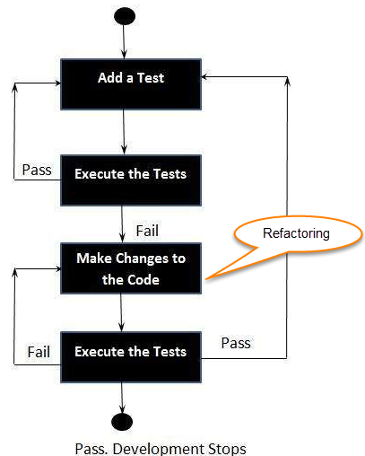
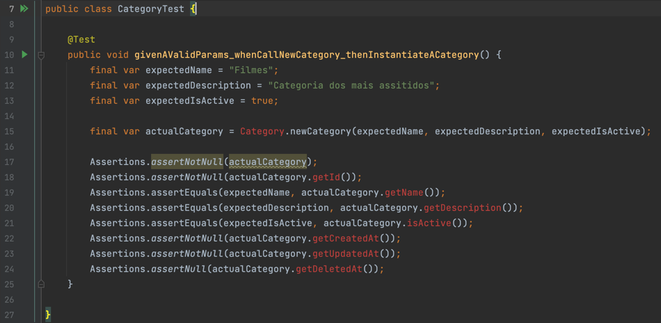
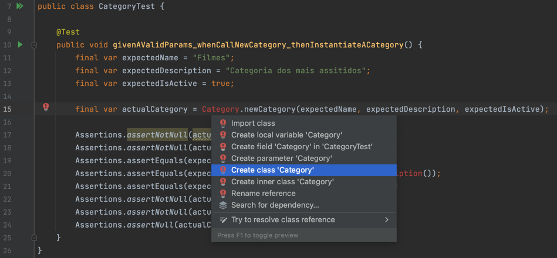
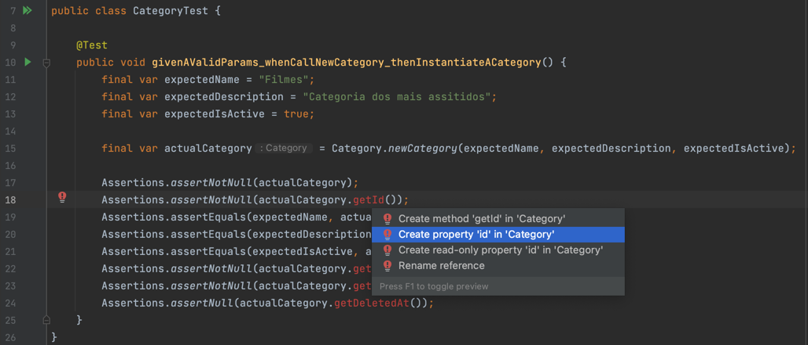
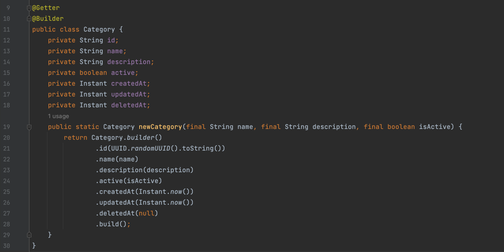
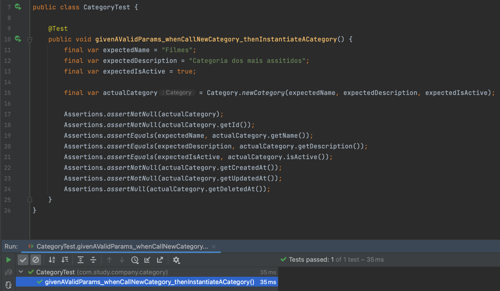

# Test Driven Development

## 1 — Pouco Sobre Testes
Conceito de testes: pirâmide de testes

Unit test:
- testa parte do código
- independente de integração\
- método, classe, função, etc
- rápidos por não dependem de framework;

Integration/Service Test:
- verificar se duas ou mais unidades que se integram funcionam;
- integração do sistema ao framework;
- camada de infraestrutura da aplicação;
- exemplo:
- bind da requisição está correta;
- repositório fazem as queries corretas;
- chamadas HTTP são feitas corretamente;

UI/E2E Tests:
- simulam o utilizador no ambiente real;
- no contexto API testes que sobem toda a aplicação e simulam o utilizador a partir de chamadas dos serviços;

## 2 - TDD & BDD
- TDD: test-driven development e BDD: behavior-driven development
- TDD e BDD são ambas metodologias de desenvolvimento de ‘software’ nas quais os testes desempenham um papel vital.
- Funcionam de maneira semelhante e geram resultados semelhantes.
- Eles não são os mesmos, no entanto.

#### TDD
O conceito simples do TDD é escrever e corrigir os testes que falharam (`red-green-refactor`) antes de escrever o novo código (antes do desenvolvimento).
Isso ajuda a evitar a `duplicação de código` à medida que escrevemos uma pequena quantidade de código de cada vez para passar nos testes.
Os testes nada mais são do que condições de requisitos que precisamos testar para cumpri-los.

#### BDD
O processo BDD começa com um recurso precisa ser criado, por exemplo, uma nova feature para adicionar um item a uma lista:

`
Feature: Add item to To-Do List
A user of the To-Do System would like to add a new item to the system.
Provided the user is logged to the system, and the item's info is valid, they should be allowed to add the item.
`

Próximo etapa é criar um ou mais cenários. Um cenário descreve um conjunto específico de condições e resultados esperados desse recurso.

`
Scenario: User wants to add an item to the TO-DO system with a past due date
Given user is logged in
And today is April 10th 2022
When the user tries to add an item with a due date of April 5th
The addition of the new item should fail
`
#### Qual escolher? TDD ou BDD?
Cada abordagem atende a uma necessidade diferente. 
- BDD é uma abordagem de alto nível, centrada no utilizador, focada em encorajar a conversa e a colaboração;
- TDD é uma técnica de desenvolvimento. É de nível inferior e centrado no desenvolvedor

## 2 - Given-When-Then
- Given-When-Then é um estilo de representação de tests;
- A ideia essencial é dividir a escrita de um cenário (ou teste) em três seções:
  - `given`: descreve o estado antes de iniciar o comportamento que especifica neste cenário, como as pré-condições para o teste. 
  - `when`: é o comportamento que especifica. 
  - `then`: descreve as mudanças que espera devido ao comportamento especificado.

## 2 — Aplicando TDD
Um exemplo aplicado neste projeto é a criação de um dominio de `Categoria` para uma aplicação de catálogo de vídeos.

### Definições de Categoria
- Nome (name), 
- descrição (description), 
- ativar e desativar (isActive), 
- auditoria(data de criação, atualização e deleção) - createdAt, updatedAt, deletedAt
- Regra de negócio:
  - Nome não deve nulo ou em branco;
  - Nome deve conter no mínimo 3 caracteres;
  - Descrição pode ser nula ou em branco;

### Criar entidade de Category com TDD:
- Iniciar criando o teste;
- Cenário: Testar que conseguimos instanciar uma Categoria - `givenAValidParams_whenCallNewCategory_thenInstantiateACategory`
- Teremos inicialmente os erros (red);

- Criar a entidade;

- Criar parâmteros e métodos;

- Teste passou

## 3 — Referências
- https://martinfowler.com/articles/practical-test-pyramid.html
- https://www.guru99.com/test-driven-development.html
- https://www.coscreen.co/blog/tdd-and-bdd/#:~:text=TDD%20stands%20for%20test%2Ddriven,development%20of%20the%20production%20code.
- https://martinfowler.com/bliki/GivenWhenThen.html